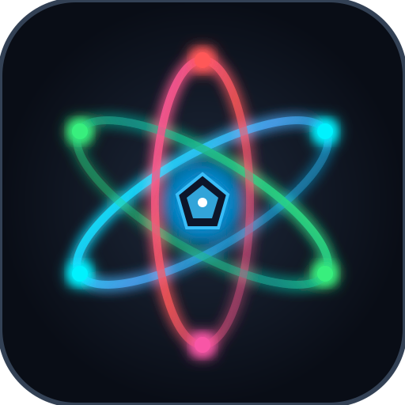

<p align="center">
  
</p>

<h1 align="center">AtomGdx Studio</h1>

<p align="center">
  <strong>Next-Gen LibGDX Integrated Game Development Environment (IDE) built on NetBeans Platform</strong>
</p>

<p align="center">
  <a href="docs/plan/v0.1.0_Milestone_Plan.md"></a>
  <a href="docs/progress/v0.1.md"></a>
  <a href="https://libgdx.com/"></a>
  <a href="docs/howto/Dev_Setup.md"></a>
  <a href="https://netbeans.apache.org/"></a>
  <a href="LICENSE"></a>
</p>

---

## 🌟 Overview

**AtomGdx Studio** is a unified game development IDE for the **LibGDX** multi-platform framework. It consolidates fragmented desktop tools into a single IDE powered by real hardware OpenGL rendering, Unity-style collapsible component inspectors, 3D SceneGraphs, and an embedded **AI Assistant & Model Context Protocol (MCP)** copilot.

---

## 🚀 Key Features

- **🎮 2D Visual Game Development**:
  - **HyperLap2D Level Designer**: Edge-to-edge hardware OpenGL canvas (`LwjglAWTCanvas`), multi-layer rendering, composite entities, Box2D physics collider overlays, and dynamic 2D lighting with soft shadows.
  - **Unity-Style 2D Inspector**: Foldouts (`▼`/`▶`) for Transform, Box2D Rigidbody, Dynamic Light 2D, and `+ Add Component` menu.
  - **SpriteSheet Editor & Image Viewer**: 1:1 Pixel Zoom, grid slicing, and live Animation Player with FPS spinner and timeline scrubber.
  - **Particle 2D Designer**: Curve editor with instant live presets (*Fireball Blast, Nebula Swarm, Toxic Spores, Cosmic Portal*).
  - **Skin Composer & 9-Patch Studio**: Scene2D / VisUI styling and interactive 9-patch border configuration.

- **🪐 3D Visual Game Development**:
  - **Native LibGDX 3D OpenGL Viewport**: Hardware rendering with `PerspectiveCamera`, `ModelBatch`, `ModelInstance`, `Environment`, and PBR directional/ambient lighting.
  - **Orbit Camera**: Left-drag to orbit, right-drag to pan, mouse wheel to zoom, ground grid, and color-coded XYZ axes.
  - **3D SceneGraph Panel**: Hierarchical tree structure (`Scene Root` &rarr; `Environment` &rarr; `Camera` &rarr; `Spacecraft` &rarr; `Thruster Light`).
  - **3D GameObject Inspector**: 3D Transform (X, Y, Z), live Vertex/Triangle counts, PBR Materials (Metallic, Roughness, Opacity), and Bullet Physics 3D.
  - **3D Asset Palette**: Primitives (*Cube, Sphere, Cylinder, Cone, Plane, Capsule*), Prefabs (*Spacecraft Fighter, Asteroid Rock, SciFi Turret, Energy Shield*), and Materials (*Metallic Gold, Brushed Steel, Neon Cyan, Hull Paint, Glass*).

- **🎵 Audio & Media Studio**:
  - Real-time stereo waveform visualizer with active playhead animation.
  - Play, Pause, Stop, Looping toggle, Volume slider (0–100%), and Stereo Pan slider (-100% to +100%).

- **🤖 AI Assistant & Model Context Protocol (MCP)**:
  - Multi-provider LLM support (Google Gemini, Anthropic Claude, OpenAI, Ollama Local).
  - MCP Server exposing live scene graphs, material definitions, and project structure directly to AI agents.

- **⚡ Project Engine & Multi-Platform Deployment**:
  - **Liftoff Project Generator**: Desktop (LWJGL3), Android, Web (TeaVM/GWT), iOS (RoboVM).
  - **One-Click Run**: "Run Desktop (LWJGL3)" executes `gradlew lwjgl3:run` with live output streaming to NetBeans Output window.

---

## 📸 Visual Verification Proofs

| 3D SceneGraph & Palette | Native OpenGL 3D Viewport | Audio & Media Studio |
| :---: | :---: | :---: |
| [Proof](docs/assets/scenegraph_3d_palette_proof.png) | [Proof](docs/assets/model3d_opengl_gpu_proof.png) | [Proof](docs/assets/media_viewer_proof.png) |

| Unity-Style 2D Inspector | 2D Particle Designer | 2D Scene & Level Designer |
| :---: | :---: | :---: |
| [Proof](docs/assets/unity_inspector_spritesheet_proof.png) | [Proof](docs/assets/particle_editor_opengl_gpu_proof.png) | [Proof](docs/assets/hyperlap2d_opengl_gpu_proof.png) |

---

## 📚 Documentation Site Map

| Document | Purpose |
| :--- | :--- |
| **[`docs/UserGuide.md`](docs/UserGuide.md)** | **Complete User Guide** covering 2D/3D workflows, tools, and deployment |
| **[`docs/plan/v0.1.0_Milestone_Plan.md`](docs/plan/v0.1.0_Milestone_Plan.md)** | Milestone architecture, version tracking, and release roadmap |
| **[`docs/progress/v0.1.md`](docs/progress/v0.1.md)** | Detailed implementation progress logs and artifact index |
| **[`docs/todo/TODO.md`](docs/todo/TODO.md)** | Living task tracker and upcoming feature backlog |
| **[`docs/howto/Dev_Setup.md`](docs/howto/Dev_Setup.md)** | Developer environment setup and JDK requirements |
| **[`docs/howto/Build_And_Run.md`](docs/howto/Build_And_Run.md)** | Build commands and execution instructions |

---

## 🛠️ Quick Start

### Prerequisites
- **Java**: JDK 21 LTS (or higher)
- **Apache NetBeans Platform**: 21+ or bundled harness
- **Ant / Gradle**: Ant 1.10+ / Gradle 8.x+

### Building the Suite
```bash
# Build the entire NetBeans Platform suite
ant build

# Run AtomGdx Studio
ant run
```

### Running Standalone E2E Visual Tests
```powershell
# Run 3D SceneGraph, Inspector & Palette E2E Test
java --add-opens=java.base/java.net=ALL-UNNAMED -cp "build/cluster/modules/*;modules/atomgdx-core/release/modules/ext/*" com.atomgdx.viewer3d.SceneGraph3DPaletteE2ETest

# Run Audio & Media Studio E2E Test
java --add-opens=java.base/java.net=ALL-UNNAMED -cp "build/cluster/modules/*;modules/atomgdx-core/release/modules/ext/*" com.atomgdx.viewer.media.AudioMediaViewerE2ETest
```

---

## 📄 License & Ecosystem

AtomGdx Studio is open-source software licensed under the **Apache License 2.0**.
Part of the **i2c platform ecosystem**. Refer to [i2c-docs](https://github.com/i2ccom/i2c-docs) for integration guidelines.
