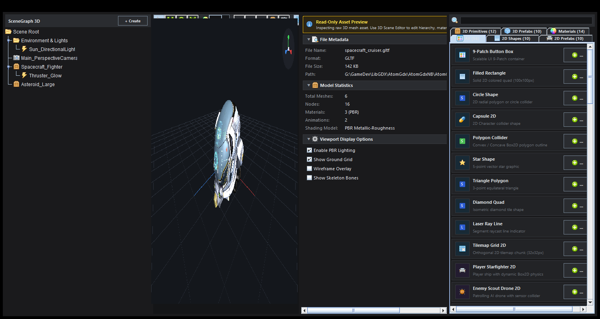
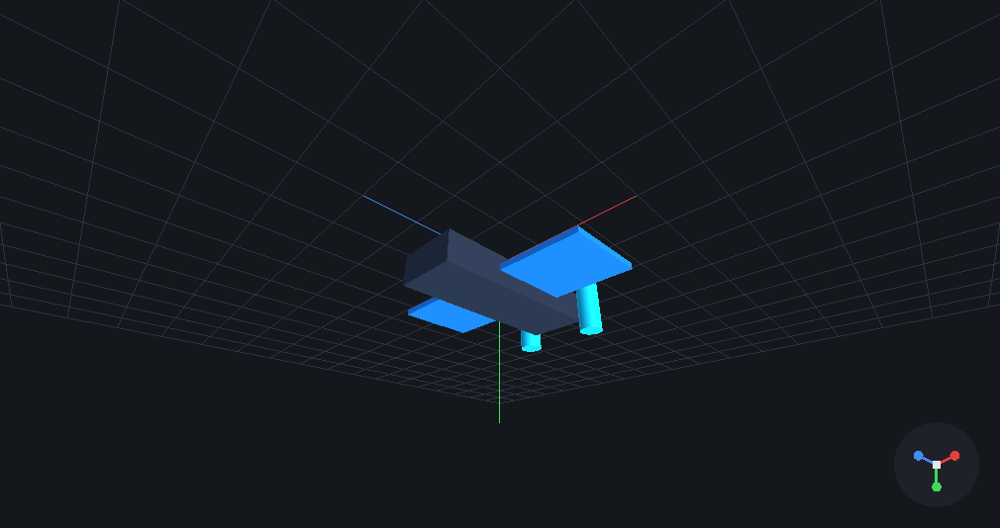
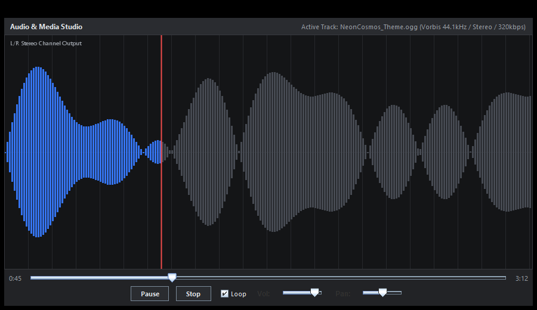
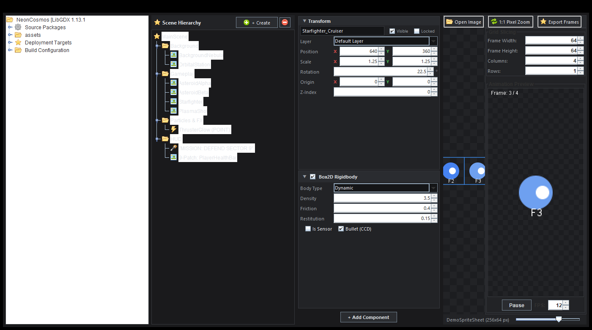
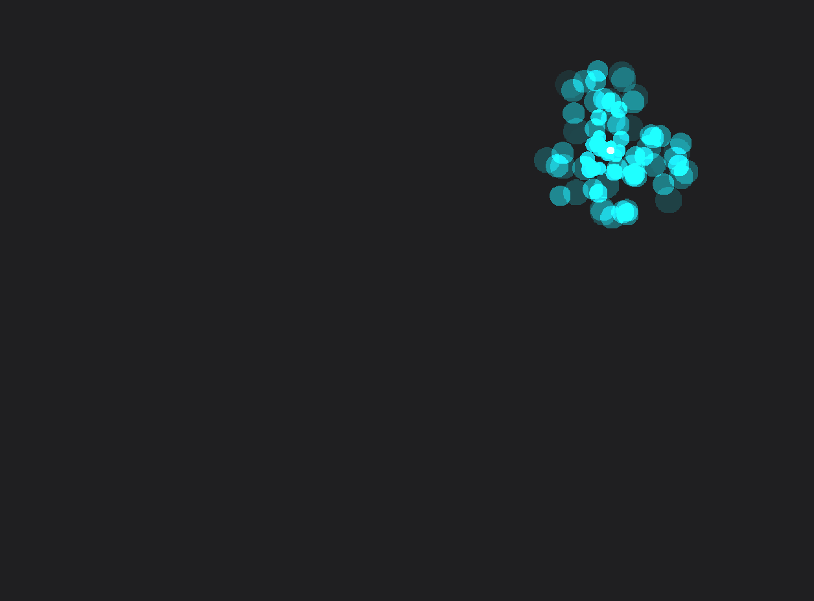
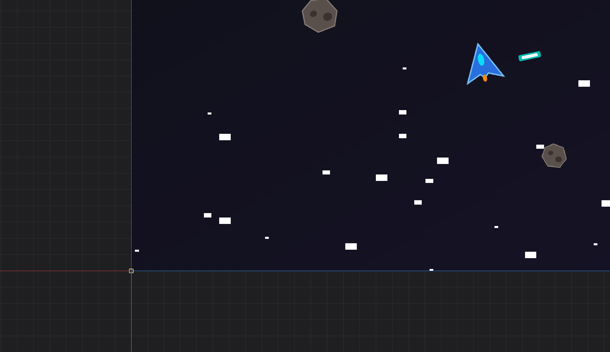

<p align="center">
  
</p>

<h1 align="center">AtomGdx Studio</h1>

<p align="center">
  <strong>Next-Gen LibGDX Integrated Game Development Environment (IDE) built on NetBeans Platform</strong>
</p>

<p align="center">
  <a href="docs/plan/v0.2.0_Milestone_Plan.md"></a>
  <a href="docs/progress/v0.2.md"></a>
  <a href="https://libgdx.com/"></a>
  <a href="docs/howto/Dev_Setup.md"></a>
  <a href="https://netbeans.apache.org/"></a>
  <a href="LICENSE"></a>
</p>

---

## 🌟 Overview

**AtomGdx Studio** is a unified game development IDE for the **LibGDX** multi-platform framework. It consolidates fragmented desktop tools into a single IDE powered by real hardware OpenGL rendering, Unity-style collapsible component inspectors, 3D SceneGraphs, and an embedded **AI Assistant & Model Context Protocol (MCP)** copilot.

---

## 🚀 Key Features

- **🎮 2D Visual Game Development & Level Construction**:
  - **TileMap Studio (Unity & Tiled Parity)**: Orthogonal, Isometric Diamond (2:1), Isometric Staggered, Hexagonal Pointy/Flat grid rendering, Unity-style Tile Palette (9 Brush tools, auto-tiling rule tiles, animated tiles, Box2D composite collision merging, and LibGDX `TmxMapLoader` export).
  - **Multi-Device Resolution Preview**: Responsive aspect letterboxing, orientation switcher (`↔`/`↕`), and safe-area notch/pill guides for iPhone 15, Pixel 8, Steam Deck, Switch, 1080p, 4K UHD.
  - **HyperLap2D Level Designer**: Edge-to-edge hardware OpenGL canvas (`LwjglAWTCanvas`), multi-layer rendering, composite entities, Box2D physics collider overlays, and dynamic 2D lighting with soft shadows.
  - **Unity-Style 2D Inspector**: Foldouts (`▼`/`▶`) for Transform, Box2D Rigidbody, Dynamic Light 2D, and `+ Add Component` menu.
  - **SpriteSheet Editor & Animation Player**: 1:1 Pixel Zoom, grid slicing, and live Animation Player with FPS spinner and timeline scrubber.
  - **Particle 2D Designer**: Curve editor with instant live presets (*Fireball Blast, Nebula Swarm, Toxic Spores, Cosmic Portal*).
  - **TexturePacker Studio**: Multi-directory atlas batch packing, whitespace trimming, and padding spinners.
  - **Bitmap & MSDF Font Studio**: TrueType/OpenType rasterization, signed distance field (SDF/MSDF) transforms, character presets, live sample testing, and GLSL distance-field shader exports.
  - **Skin Composer & 9-Patch Studio**: Scene2D / VisUI styling, Widget Styles manager, and interactive 9-patch border configuration.

- **🪐 3D Visual Game Development & Graphics Studio**:
  - **Native LibGDX 3D OpenGL Viewport**: Hardware rendering with `PerspectiveCamera`, `ModelBatch`, `ModelInstance`, `Environment`, and PBR directional/ambient lighting.
  - **Interactive 3D Transform Gizmos**: Color-coded Translate arrows (RGB), Rotation gimbal rings, and Scale handles directly on the canvas.
  - **PBR Material & Shader Studio**: Sliders for Albedo, Metallic, Roughness, Normal Map, AO, Emissive rim glow, Clearcoat, and live GLSL uniform preview.
  - **Environment Lighting & HDRI Skybox Studio**: HDRI skybox presets, IBL diffuse/specular reflections, Sun Orbit Compass (Pitch/Yaw), dynamic shadows, and distance fog.
  - **3D SceneGraph Panel**: Hierarchical tree structure (`Scene Root` &rarr; `Environment` &rarr; `Camera` &rarr; `Spacecraft` &rarr; `Thruster Light`).
  - **3D GameObject Inspector**: 3D Transform (X, Y, Z), live Vertex/Triangle counts, PBR Materials (Metallic, Roughness, Opacity), and Bullet Physics 3D.
  - **3D Particle Flame Studio**: 3D flame particle system editor with emitter lifecycle manager, physics gravity influencers, and live 60 FPS simulation canvas.
  - **3D Asset Palette**: Primitives (*Cube, Sphere, Cylinder, Cone, Plane, Capsule*), Prefabs (*Spacecraft Fighter, Asteroid Rock, SciFi Turret, Energy Shield*), and Materials (*Metallic Gold, Brushed Steel, Neon Cyan, Hull Paint, Glass*).

- **🎞️ Animation Timeline Studio**:
  - Dope-sheet scrubber supporting 4 animation architectures: **Node Properties**, **Skeletal 2D (Spine/DragonBones)**, **Skeleton 3D (glTF Rig)**, and **SpriteFrames Ex (Paperdoll)**.
  - Event markers with custom parameter payload inspector (Audio cues, string/int/float parameters).
  - 60 FPS transport playback with speed multipliers (0.25x to 4.0x), keyframe easing curves (Linear, Step, Ease In/Out, Bounce, Elastic), and onion skinning.

- **🧩 Ashley ECS Component Registry & Prefabs**:
  - Introspects built-in engine components and generates custom Ashley ECS Java component classes.
  - Reusable 2D & 3D entity prefab creation and scene instantiation.

- **🎵 Audio & Media Studio**:
  - Real-time stereo waveform visualizer with active playhead animation.
  - Play, Pause, Stop, Looping toggle, Volume slider (0–100%), and Stereo Pan slider (-100% to +100%).

- **🤖 AI Assistant & Model Context Protocol (MCP)**:
  - Multi-provider LLM support (Google Gemini, Anthropic Claude, OpenAI, Ollama Local).
  - MCP Server exposing live scene graphs, material definitions, and project structure directly to AI agents.

- **⚡ Multi-Platform Build Configuration Matrix**:
  - Targets: Desktop (LWJGL3), Android (APK/AAB), Web (TeaVM/GWT), iOS (RoboVM).
  - Custom JVM profiles and live build execution streamed to NetBeans Output console.

---

## 📸 Screenshots & Feature Showcase

| 3D SceneGraph & Palette | Native OpenGL 3D Viewport | Audio & Media Studio |
| :---: | :---: | :---: |
|  |  |  |

| Unity-Style 2D Inspector | 2D Particle Designer | 2D Scene & Level Designer |
| :---: | :---: | :---: |
|  |  |  |

---

## 📚 Documentation Site Map

| Document | Purpose |
| :--- | :--- |
| **[`docs/UserGuide.md`](docs/UserGuide.md)** | **Complete User Guide** covering 2D/3D workflows, tools, and deployment |
| **[`docs/plan/v0.2.0_Milestone_Plan.md`](docs/plan/v0.2.0_Milestone_Plan.md)** | **v0.2.0 Active Milestone Plan** (Device Switcher, Timeline, PBR Material Studio) |
| **[`docs/plan/v0.1.0_Milestone_Plan.md`](docs/plan/v0.1.0_Milestone_Plan.md)** | v0.1 Milestone architecture, version tracking, and release archive |
| **[`docs/progress/v0.2.md`](docs/progress/v0.2.md)** | v0.2 implementation progress logs and artifact index |
| **[`docs/progress/v0.1.md`](docs/progress/v0.1.md)** | v0.1 completed implementation logs and history |
| **[`docs/todo/TODO.md`](docs/todo/TODO.md)** | Living task tracker and upcoming feature backlog |
| **[`docs/howto/Dev_Setup.md`](docs/howto/Dev_Setup.md)** | Developer environment setup and JDK requirements |
| **[`docs/howto/Build_And_Run.md`](docs/howto/Build_And_Run.md)** | Build commands and execution instructions |

---

## 🛠️ Quick Start

### Prerequisites
- **Java**: JDK 21 LTS (or higher)
- **Apache NetBeans Platform**: 21+ or bundled harness
- **Ant / Gradle**: Ant 1.10+ / Gradle 8.x+

### Building the Suite
```bash
# Build the entire NetBeans Platform suite
ant build

# Run AtomGdx Studio
ant run
```

### Running Standalone E2E Visual Tests
```powershell
# Run 3D SceneGraph, Inspector & Palette E2E Test
java --add-opens=java.base/java.net=ALL-UNNAMED -cp "build/cluster/modules/*;modules/atomgdx-core/release/modules/ext/*" com.atomgdx.viewer3d.SceneGraph3DPaletteE2ETest

# Run Audio & Media Studio E2E Test
java --add-opens=java.base/java.net=ALL-UNNAMED -cp "build/cluster/modules/*;modules/atomgdx-core/release/modules/ext/*" com.atomgdx.viewer.media.AudioMediaViewerE2ETest
```

---

## 📄 License & Ecosystem

AtomGdx Studio is open-source software licensed under the **Apache License 2.0**.
Part of the **i2c platform ecosystem**. Refer to [i2c-docs](https://github.com/i2ccom/i2c-docs) for integration guidelines.
