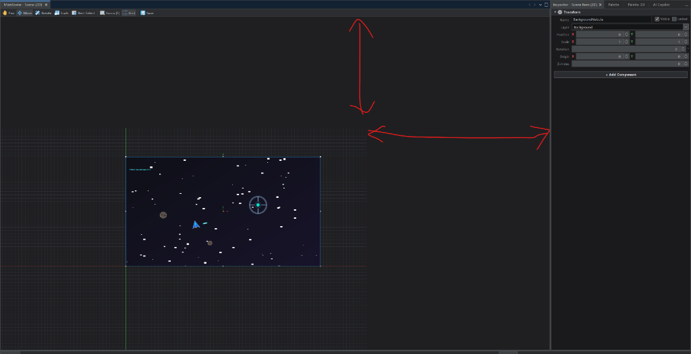

# Issue Report: Scene 2D Canvas Viewport Void Gap & Mouse Interaction Offset

- **Issue ID**: `ISSUE-20260820-001`
- **Date**: `2026-08-20 20:18:06`
- **Module**: `modules/atomgdx-editor-scene2d`, `modules/atomgdx-core`, `modules/atomgdx-ui-theme`
- **Status**: Open / Handoff

---

## 1. Problem Description

When running the NetBeans application and opening the **Scene (2D)** editor tab (`Scene2DTopComponent`):
1. **Bad Viewport Gap (Void space)**:
   - The LibGDX OpenGL canvas rendering (the grid, background objects, and axes) renders in a fixed sub-rectangle in the lower-left portion of the editor area (approx 800x600).
   - The top and right regions of the center editor tab remain solid black/unrendered (indicated by the red double arrows in the screenshot below).
2. **Bad Mouse Coordinate Offset**:
   - Clicking and dragging on the canvas does not match the visual positions of objects.
   - Rectangular marquee selection and click hit-testing (`findItemAt`, `findAllItemsInRect`) are misaligned with rendered elements.

---

## 2. Screenshot & Visual Evidence



---

## 3. Technical Analysis & Root Causes

### A. Viewport Sizing & OpenGL Clipping
- **Component**: `modules/atomgdx-core/src/main/java/com/atomgdx/core/viewport/GdxAwtViewport.java` & `modules/atomgdx-editor-scene2d/src/main/java/com/atomgdx/editor/scene2d/ui/Scene2DViewportListener.java`
- **Mechanism**:
  - LibGDX `LwjglAWTCanvas` wraps a heavyweight AWT `java.awt.Canvas`.
  - When hosted inside a NetBeans `TopComponent` (`Scene2DTopComponent`), the NetBeans window manager docks and resizes the parent Swing containers (`BorderLayout`).
  - If `LwjglAWTCanvas` is created with default dimensions (or before NetBeans completes initial layout), `Gdx.graphics.getWidth()` and `Gdx.graphics.getHeight()` stay fixed to the initial size (e.g., 800x600) unless the AWT `Canvas` component triggers a native peer resize and `Gdx.gl.glViewport(0, 0, width, height)` is updated with the actual live pixel width/height of the container.
  - OpenGL cannot render outside the active `glViewport`.

### B. Mouse Coordinate Conversion Misalignment
- **Component**: `modules/atomgdx-editor-scene2d/src/main/java/com/atomgdx/editor/scene2d/ui/Scene2DEditorPanel.java` & `modules/atomgdx-editor-scene2d/src/main/java/com/atomgdx/editor/scene2d/ui/Scene2DViewportListener.java`
- **Mechanism**:
  - Mouse events (`MouseEvent e`) from Swing deliver screen coordinates `(e.getX(), e.getY())` bounded by `[0, CanvasWidth] x [0, CanvasHeight]`.
  - LibGDX `camera.unproject()` relies on `Gdx.graphics.getHeight()` for Y-axis inversion (`y = Gdx.graphics.getHeight() - screenY`).
  - If `Gdx.graphics.getHeight()` does not match `canvas.getHeight()`, the unprojected world coordinates are completely shifted, causing clicks and marquee selection to miss objects.

---

## 4. Key Files Involved

| File | Path | Key Responsibility |
|---|---|---|
| `GdxAwtViewport.java` | `modules/atomgdx-core/src/main/java/com/atomgdx/core/viewport/GdxAwtViewport.java` | Hosts `LwjglAWTCanvas`, forces edge-to-edge component resizing. |
| `Scene2DViewportListener.java` | `modules/atomgdx-editor-scene2d/src/main/java/com/atomgdx/editor/scene2d/ui/Scene2DViewportListener.java` | LibGDX `ApplicationListener`, manages camera, viewport sizing, `render()`, `renderGrid()`, and `screenToWorld()`. |
| `Scene2DEditorPanel.java` | `modules/atomgdx-editor-scene2d/src/main/java/com/atomgdx/editor/scene2d/ui/Scene2DEditorPanel.java` | Swing container for toolbar + viewport, handles mouse clicks, panning, zooming, and hit testing. |
| `Scene2DTopComponent.java` | `modules/atomgdx-ui-theme/src/main/java/com/atomgdx/theme/windows/Scene2DTopComponent.java` | NetBeans editor TopComponent hosting `Scene2DEditorPanel`. |

---

## 5. Recommended Handoff Action Items

1. **Verify Live Canvas Dimension Propagation**:
   - Ensure `LwjglAWTCanvas.getCanvas()` actively resizes to `(0, 0, getWidth(), getHeight())` inside NetBeans docking/layout cycles.
   - In `Scene2DViewportListener.render()`, ensure `Gdx.gl.glViewport(0, 0, curW, curH)` accurately covers the entire available client area.
2. **Standardize Coordinate Conversion**:
   - Ensure all mouse interaction paths (`mousePressed`, `mouseDragged`, `mouseWheelMoved`) compute world coordinates using:
     `worldX = camera.position.x + (screenX - canvasWidth / 2f) * camera.zoom`
     `worldY = camera.position.y + (canvasHeight / 2f - screenY) * camera.zoom`
3. **Build & Verification**:
   - Run:
     ```powershell
     & 'C:\Program Files\NetBeans-23\netbeans\extide\ant\bin\ant.bat' build
     ```
   - Verify by running the application (`ant run` or running NetBeans) and checking the 2D scene tab.
